# BuzzBid – Online Auction Platform

BuzzBid is a simplified online auction platform built as part of the **Georgia Tech OMSCS CS6400 – Database Systems** course project. The application allows users to list items for auction, search for items, place bids, purchase items instantly, and rate completed transactions.

The goal of the project was to design a **normalized relational database schema**, implement a **full-stack web application**, and build **analytical reports using SQL**.

---

# System Overview

BuzzBid is an auction marketplace similar to eBay but intentionally simplified for educational purposes.

Users can:

- Register and log into the platform
- List items for auction
- Search and browse available auctions
- Place bids on items
- Buy items instantly using **Get It Now**
- Rate items after winning auctions

Administrative users have additional capabilities:

- Cancel auctions
- Delete ratings
- View system reports and analytics

---

# Tech Stack

**Backend**

- PHP
- MySQL

**Frontend**

- HTML
- CSS
- Vanilla JavaScript

**Server**

- Apache or any PHP-compatible web server

**Database Design**

- Enhanced Entity Relationship (EER) modeling
- Normalized relational schema

---

# Key Features

## User Accounts

- User registration with unique username
- Authentication via username/password
- Two user roles:
  - Regular users
  - Administrative users

Administrative privileges are assigned directly in the database.

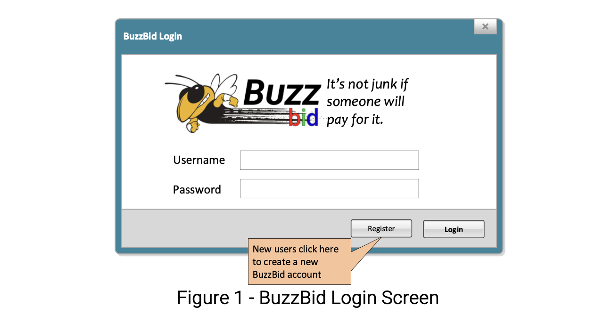
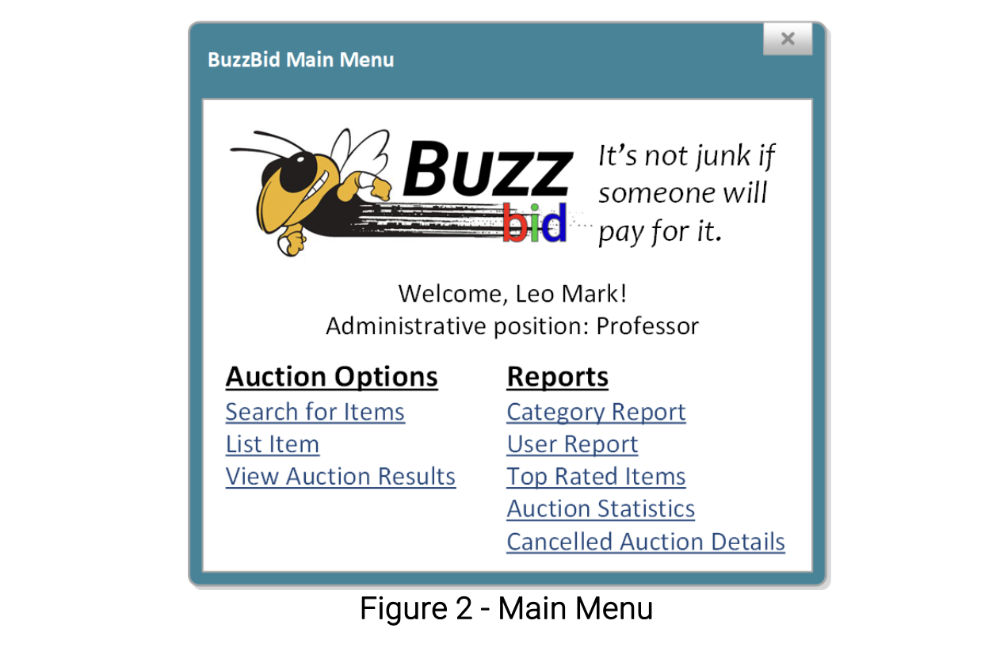
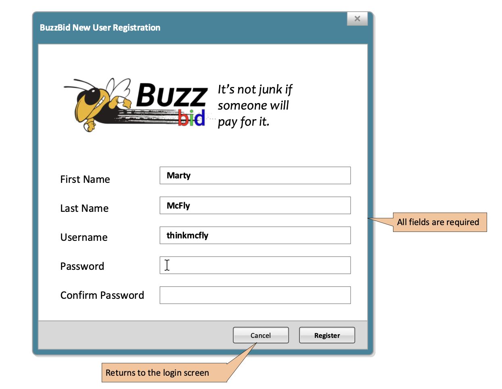


---

## Item Listings

Users can create auction listings with:

- Item name
- Description
- Category
- Item condition
- Starting bid
- Minimum sale price (hidden from bidders)
- Optional **Get It Now** price
- Auction duration (1, 3, 5, or 7 days)

Each item receives a unique **Item ID** generated automatically by the system.

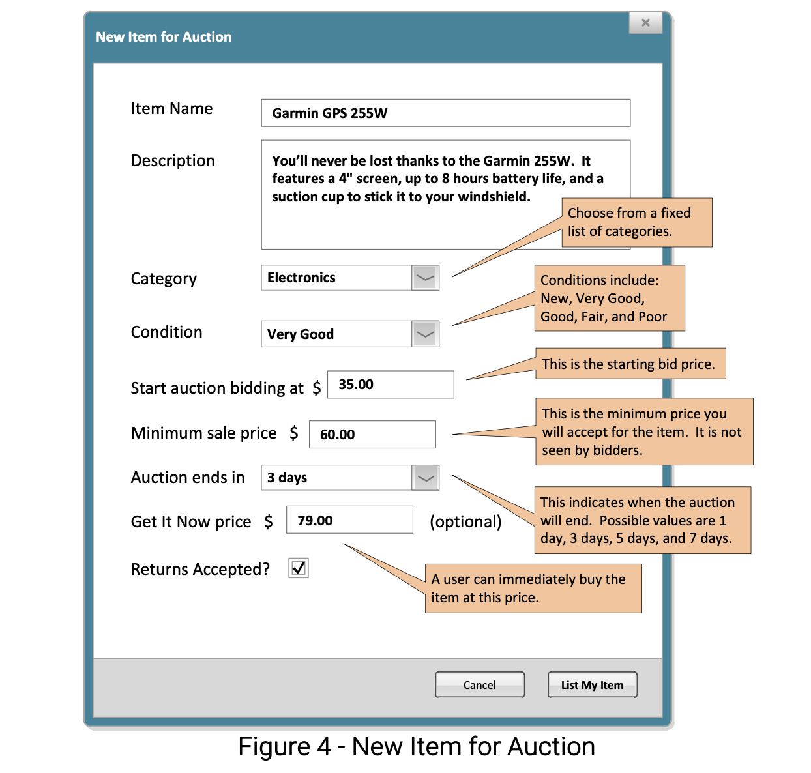

---

## Bidding System

Users can place bids on active auctions.

Rules implemented:

- Bids must be at least **$1 higher than the current bid**
- Users **cannot bid on their own listings**
- Bids must be **below the Get It Now price**
- Auctions close when:
  - The auction duration expires, or
  - A user purchases using **Get It Now**
 
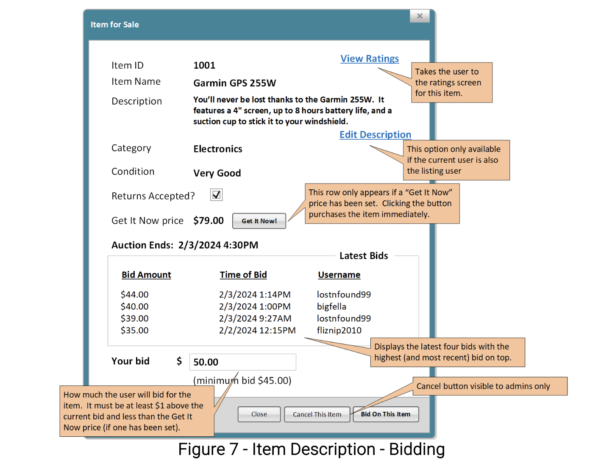

---

## Item Search

Users can search listings using multiple filters:

- Keyword (name or description)
- Category
- Minimum price
- Maximum price
- Minimum item condition

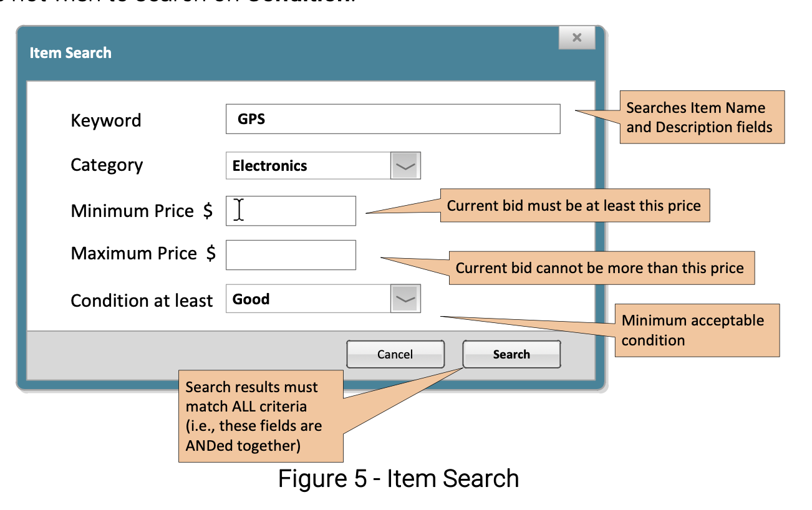

Search results include:

- Item ID
- Item name
- Current bid
- Highest bidder
- Get It Now price
- Auction end time

Results are sorted by **auction end time**.

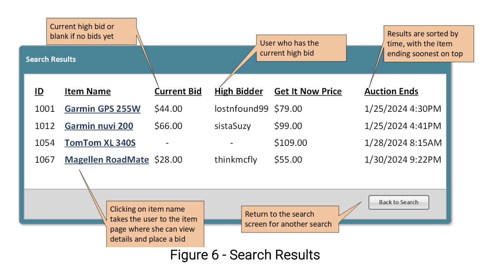

---

## Ratings System

After winning an auction, users can rate items:

- Rating scale: **0–5 stars**
- Optional written comment
- Users may rate a listing only once

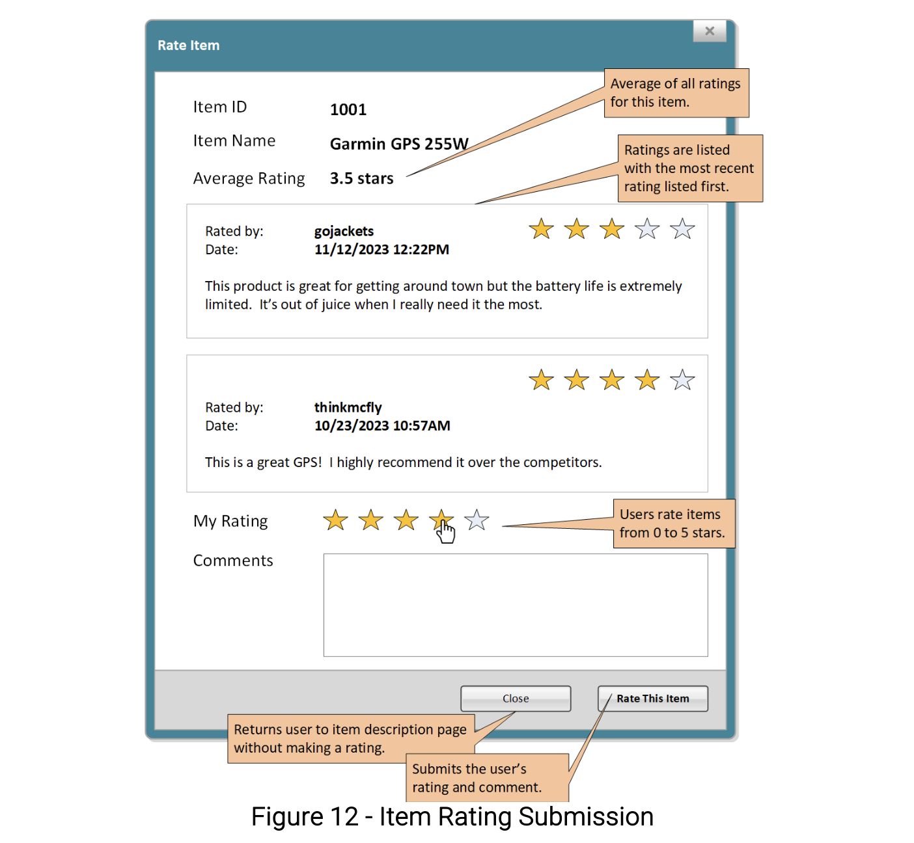

The system also calculates:

- Average rating per item name
- Historical ratings across identical item names

Administrators can remove inappropriate ratings.

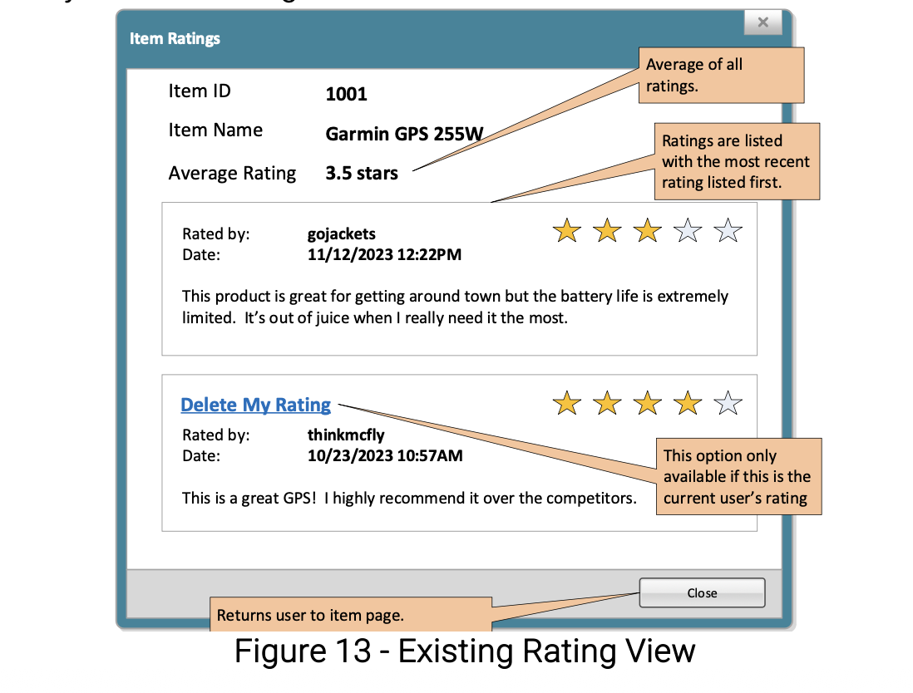

---

# Auction Resolution Logic

When auctions end, the system determines outcomes using the following logic:

### Get It Now purchase
- Winner: buyer
- Sale price: Get It Now price

### Successful auction
- If highest bid ≥ minimum sale price
- Winner: highest bidder
- Sale price: highest bid

### No sale
- If highest bid < minimum sale price
- No winner is declared

### Cancelled auction
- Winner listed as **Cancelled**
- Cancellation reason stored in the database

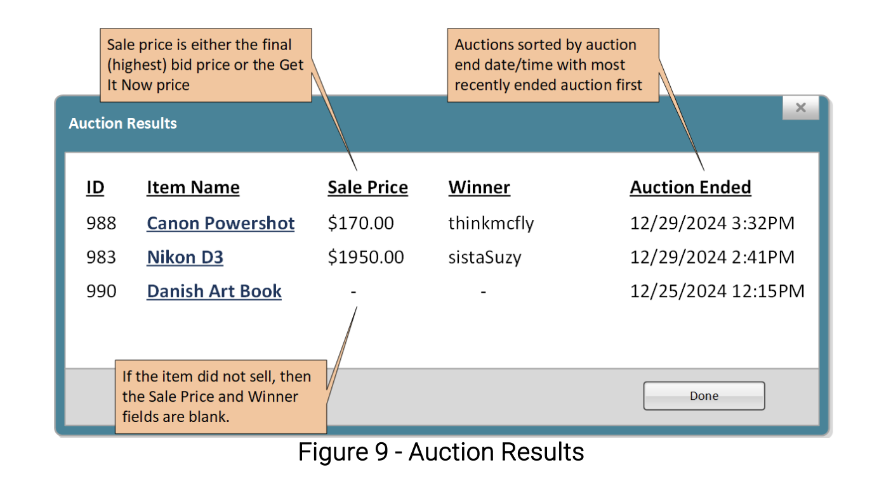

---

# Administrative Reports

The platform includes several SQL-driven analytics reports.

## Category Report

Aggregates items by category:

- Total items
- Minimum price
- Maximum price
- Average price

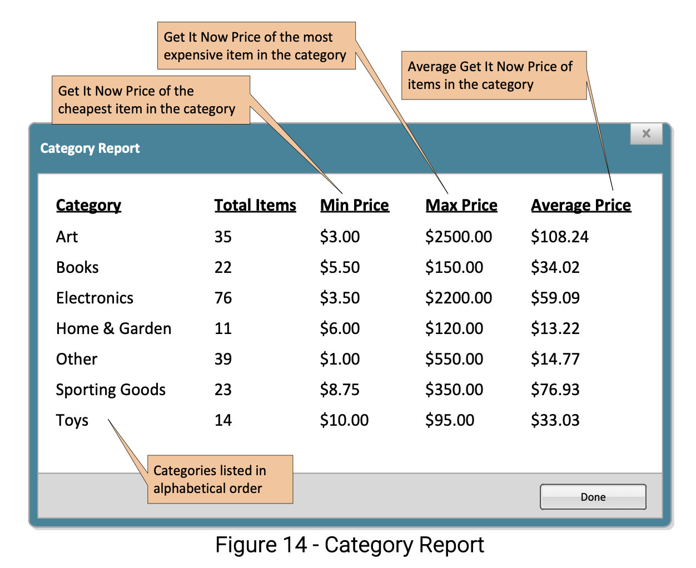

---

## User Report

Provides statistics per user:

- Items listed
- Items sold
- Items won
- Items rated
- Most common listing condition

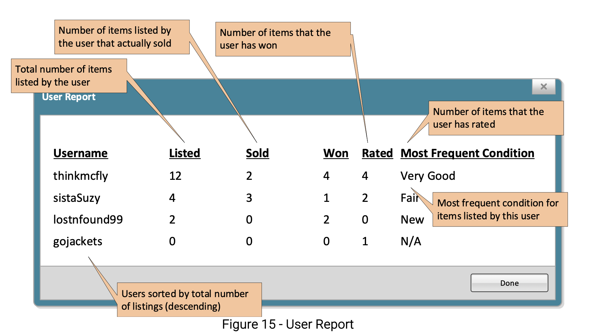

---

## Top Rated Items

Displays the **top 10 highest rated items**, sorted by:

1. Average rating (descending)
2. Item name (ascending)

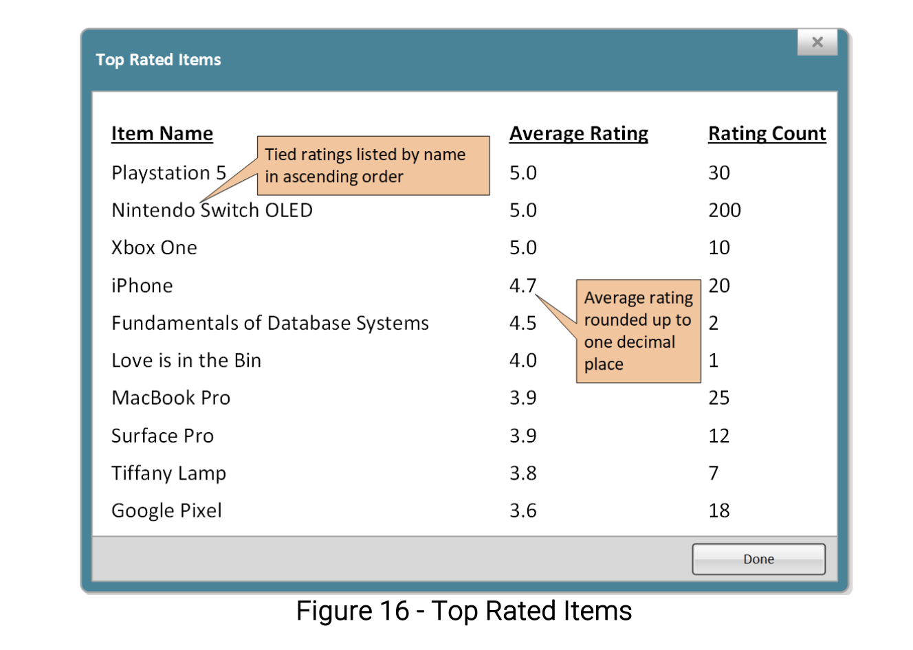

---

## Auction Statistics

Summary metrics including:

- Active auctions
- Finished auctions
- Won auctions
- Cancelled auctions
- Rated items
- Unrated items


---

## Cancelled Auction Details

Lists cancelled auctions including:

- Item ID
- User who listed the item
- Cancellation date/time
- Cancellation reason

---

# Database Design

The system database was modeled using an **Enhanced Entity-Relationship (EER) diagram** including:

- Strong entities
- Weak entities
- Identifying relationships
- Cardinality constraints
- Participation constraints
- Composite and multi-valued attributes

The diagram is included in this repository.

---

# Running the Project Locally

## 1. Clone the repository

```bash
git clone https://github.com/kkashiva/buzzbid.git
```

## 2. Setup the database

Create a MySQL database and import the schema.

Example:
```bash
CREATE DATABASE buzzbid;
USE buzzbid;
SOURCE schema.sql;
```

## 3. Configure database connection

Update database credentials in the PHP configuration file.

Example:
```bash
$db_host = "localhost";
$db_user = "root";
$db_pass = "password";
$db_name = "buzzbid";
```

## 4. Start a local server

You can run the project using:
-	Apache
- XAMPP
- MAMP
- PHP built-in server

```bash
php -S localhost:8000
```

Then open:
```bash
http://localhost:8000
```

# Learning Objectives

This project focused on:
- Relational database design
- EER modeling
- SQL aggregation and reporting
- Transaction logic
- Full-stack web development with PHP and MySQL
